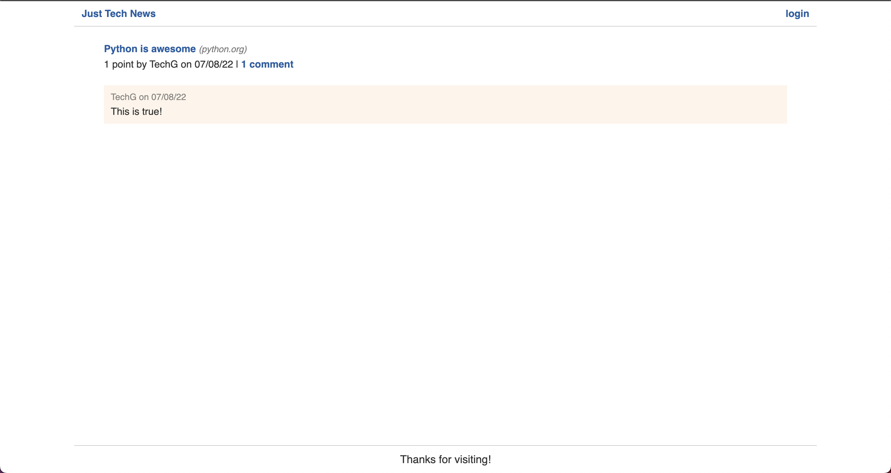
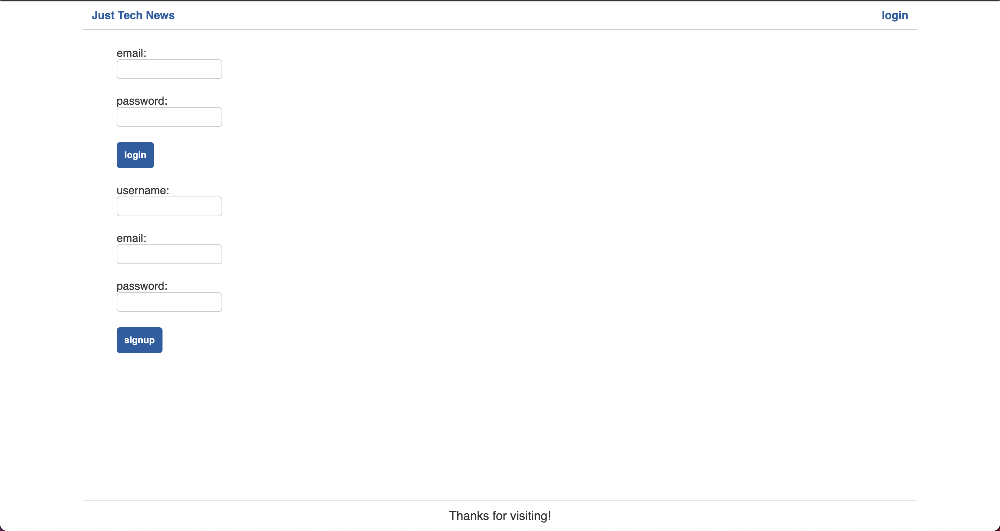
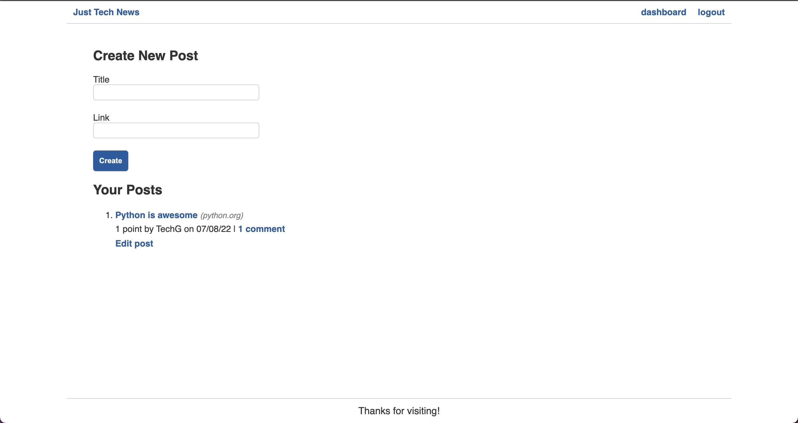
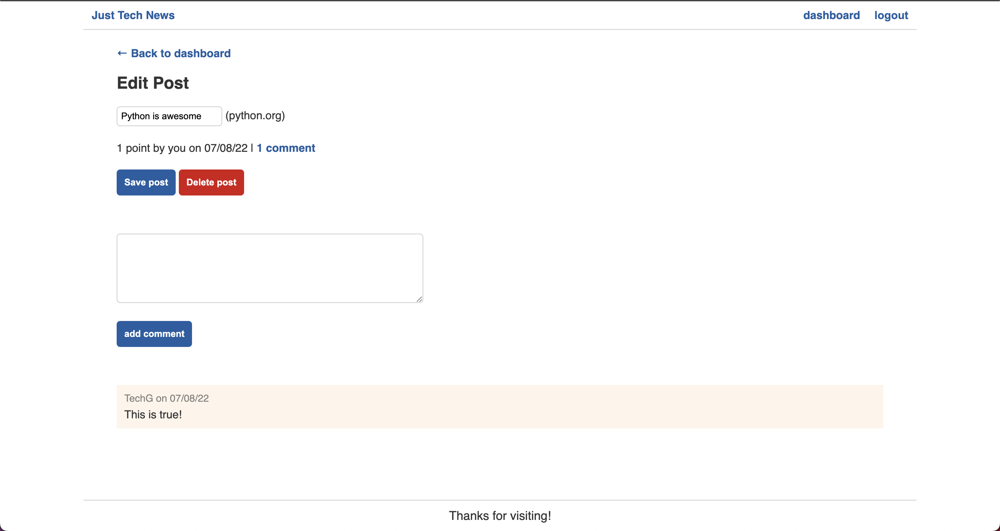

# Tech News Java Api

## Description

This app was created for users that want to share new tech they have discovered or see what other tech users have found. 

## Table of Contents

- [Usage](#usage)
- [Contributing](#contributing)
- [Questions](#questions)
- [Link](#link)

### Usage

Upon entering the app you will see the dashboard where you can view users posts. We can also see the amount of upvotes and read comments from other users!

If there is a new user they will need to login in order to create, comment, and upvote any posts which they can do by clicking the login button.

Once the user has either signed up or logged in, they will be redirected to their personal dashboard. Here the user can see the posts they have created. 

Users can then click the edit button after creating a post to update or delete a post. Users will also now have the ability to upvote posts.

### Contributing

If you would like to contribute to this app please fork the repo and submit a pull request.

### Questions

If you have any questions please reach out by going to my Github profile where you will find my email.

### Link

Click [here](https://cc-java-api-77.herokuapp.com/) to try out the deployed app!
